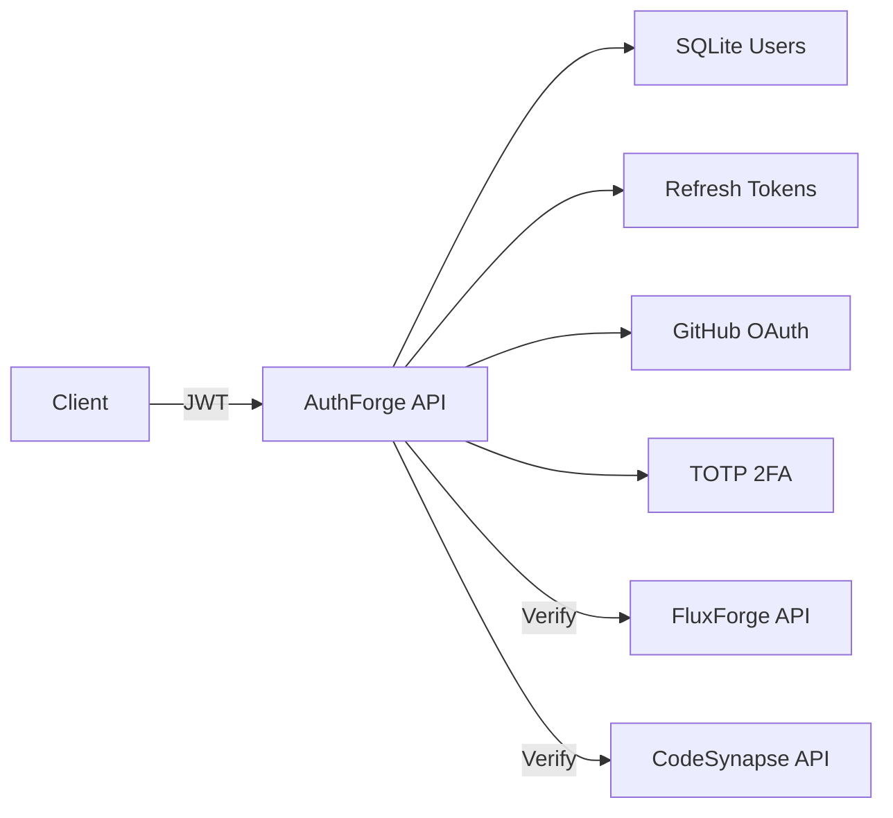

# AuthForge

> Identity Provider universal con JWT, refresh tokens rotativos, 2FA TOTP y OAuth2 Client.

## 🏗️ Architecture



## 🔐 Security Features

| Feature | Implementation | Standard |
| --- | --- | --- |
| Authentication | bcrypt + JWT | RFC 7519 |
| Session Management | Refresh tokens with rotation | OAuth2 BCP |
| 2FA | TOTP via otplib | RFC 6238 |
| OAuth2 Client | GitHub integration | RFC 6749 |
| RBAC | Role-based middleware | - |

## 🛠️ Stack

Node.js · Fastify · TypeScript · better-sqlite3 · jsonwebtoken · otplib · bcrypt

## 🚀 Deploy

```bash
# Local
npm install
npm run dev

# Docker
docker build -t authforge-api .
docker run -p 4000:4000 -e JWT_SECRET=supersecret authforge-api
```

## 📋 Endpoints

| Method | Endpoint | Auth | Description |
| --- | --- | --- | --- |
| POST | `/api/auth/register` | - | Create account |
| POST | `/api/auth/login` | - | Get tokens |
| POST | `/api/auth/2fa/login` | - | Login with TOTP |
| POST | `/api/auth/refresh` | - | Rotate tokens |
| POST | `/api/auth/logout` | - | Revoke session |
| GET | `/api/auth/me` | Bearer | Current user |
| POST | `/api/auth/2fa/setup` | Bearer | Generate QR |
| POST | `/api/auth/2fa/verify` | Bearer | Enable 2FA |
| GET | `/api/auth/oauth/github` | - | GitHub login |
| GET | `/api/auth/sessions/all` | Bearer + admin | List sessions |
| DELETE | `/api/auth/sessions/:id` | Bearer | Revoke session |

## 📄 License

MIT
